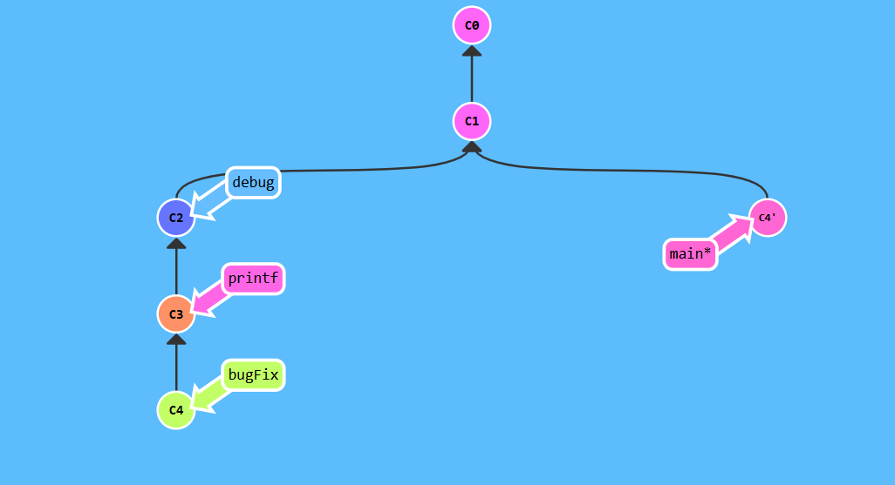
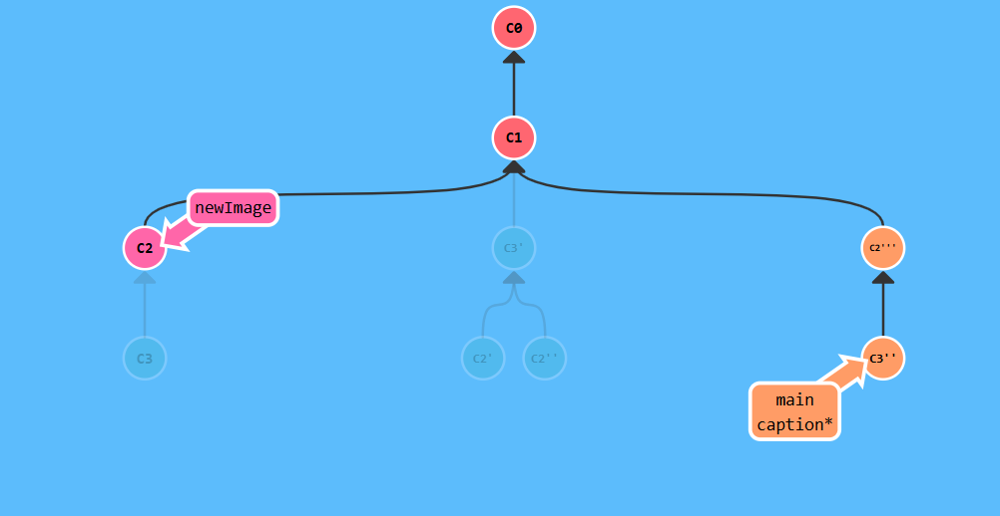
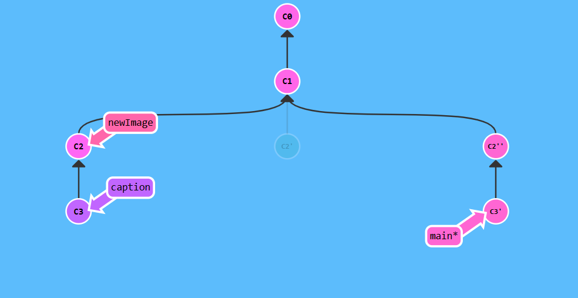
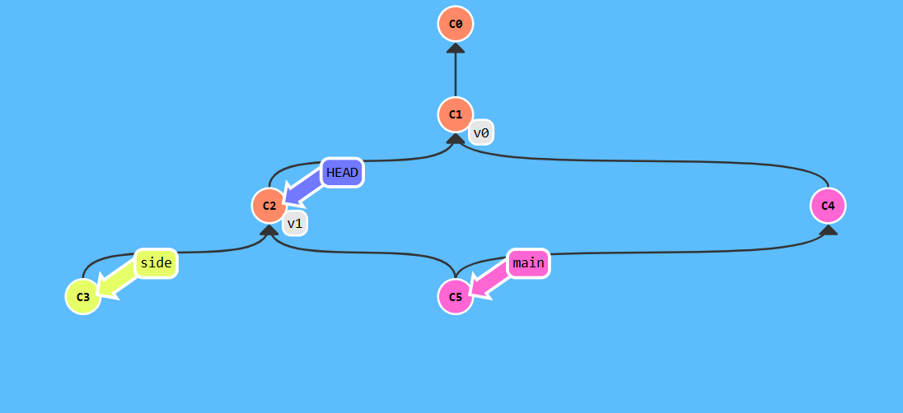
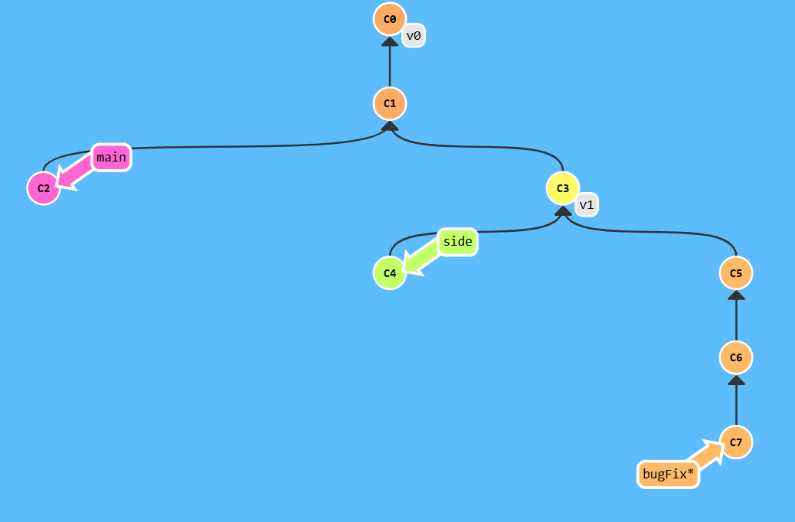

## A Mixed Bag
## Level 1 Locally stacked commits

Understand the concept of cherrypick. 


``` bash
$ git checkout main
$ git cherry-pick c4
```
## Level 2 Juggling Commits
Rebase concept

 

``` bash
$ git rebase -i c1
$ git rebase -i c3
$ git rebase -i c1
$ git branch -f main c3
```
## Level 3 Juggling Commits #2

Cherrypick concept


```bash
$ git checkout c2
$ git commit --amend
$ git checkout main
$ git cherry-pick c2
$ git cherry-pick c3

```
## Level 4 Git Tags
Branches are easily mutated, often temporary, and always changing.
But we can mark them permanently historical points in our project's history. For things like major releases and big merges, it uses git tags.


```bash
$ git tag v0 c1
$ git checkout c2
$ git tag v1 c2
```
## Level 5 Git Describe
Tags serve as such great "anchors" in the codebase,git describe shows the detail of the branch .

```bash
$ git describe main
v0_2_gC2
$ git describe side
v1_1_gC4
$ git describe bugFix
v1_2_gC6
$ git commit
```