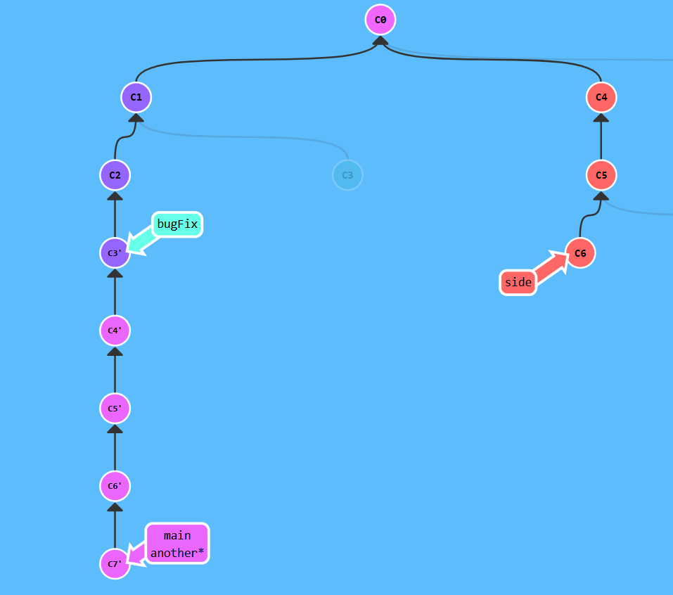
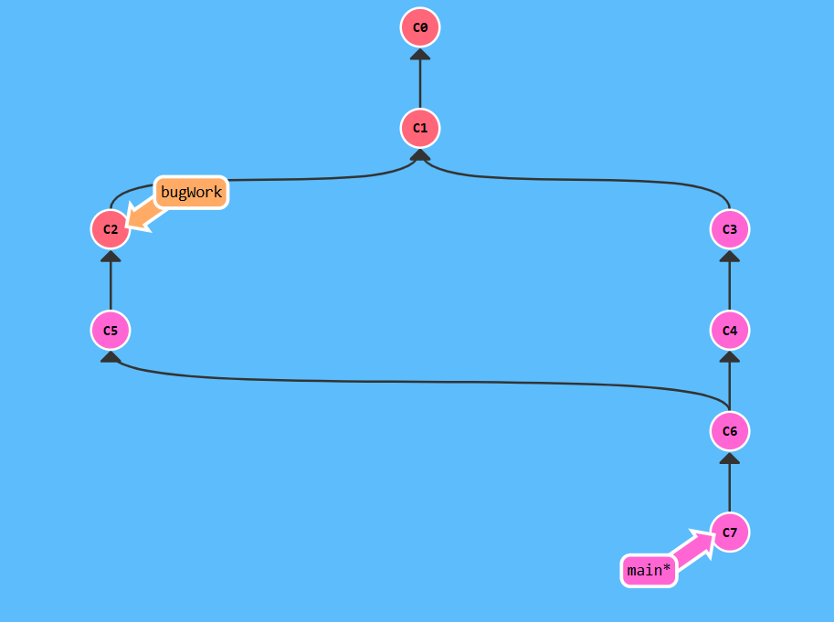
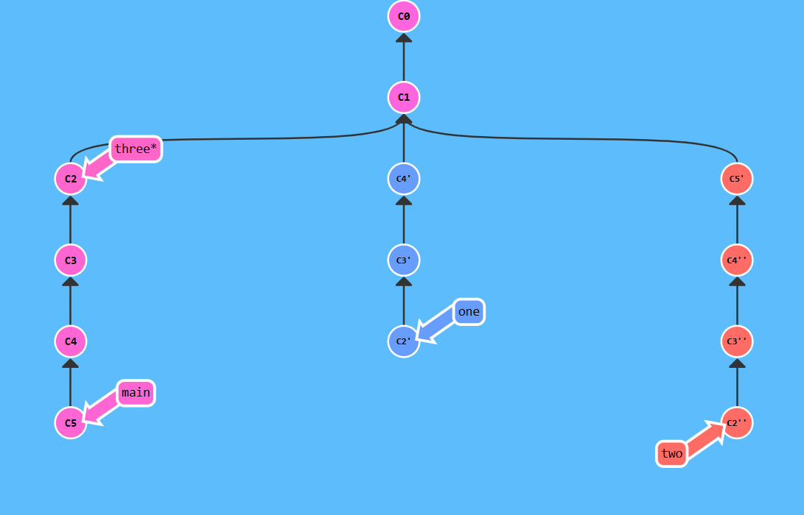

## Advanced Topics
## Level 1


```bash 
$ git checkout bugFix
$ git rebase -i c2
$ git checkout c4
$ git rebase -i bugFix
$ git checkout C5
$ git rebase c4
$ git checkout c6
$ git rebase c5
$ git checkout c7
$ git rebase c6
$ git branch -f main c7
```

## Level 2

```bash
$ git branch -f bugWork c2
```
## Level 3
Branch Spaghetti

```bash
$ git checkout one
$ git cherry-pick c4 c3
$ undo
$ git cherry-pick c4 c3 c2
$ git checkout two
$ git cherry-pick c5 c4' c3' c2' 
$ git branch -f three c2
```