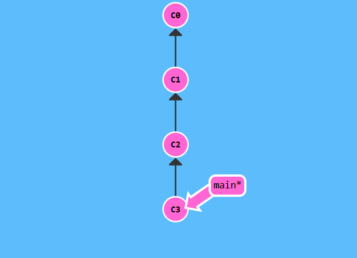
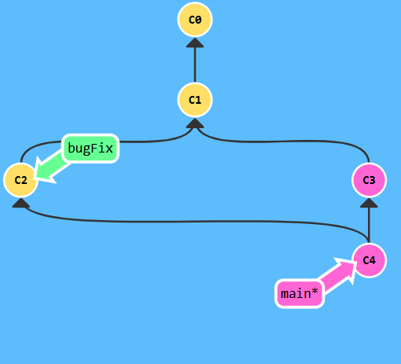

## Introduction Sequence
## Level 1



```bash
$ git commit
$ git commit

```
## Level 2
 


```bash
$ git branch bugFix
$ git checkout bugFix
```


## Level 3



```bash
$ git branch bugFix
$ git checkout bugFix
$ git commit
$ git checkout main
$ git commit
$ git merge bugFix

```
 
# Level 4


```bash
$ git branch bugFix
$ git checkout bugFix
$ git commit
$ git checkout main
$ git commit
$ git checkout bugFix
$ git rebase main
```