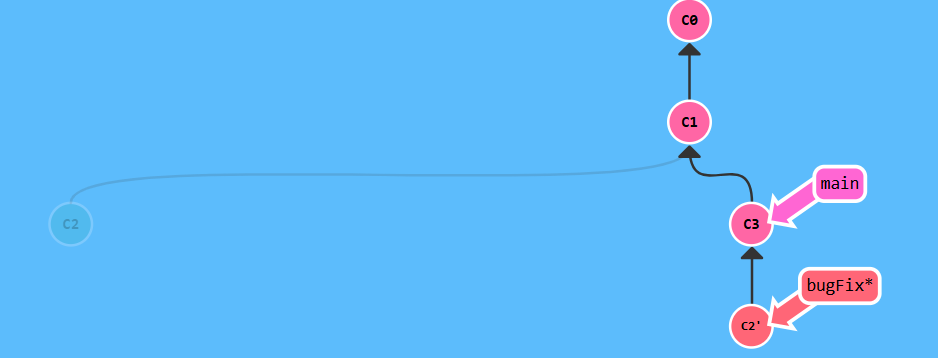

## Introduction Sequence
## Level 1  Git Commits
 Each commit maintains a storage, updates and maintains by making version control powerful and fast.


```bash
$ git commit
$ git commit

```
## Level 2  Git Branches
 Branches in Git allow developers to work on different features simultaneously. 


```bash
$ git branch bugFix
$ git checkout bugFix
```


## Level 3 Branches and Merging
Merging is a way to combine work,it takes changes from both branches. This helps integrate updates into a single main branch.


```bash
$ git branch bugFix
$ git checkout bugFix
$ git commit
$ git checkout main
$ git commit
$ git merge bugFix

```
 
# Level 4  Git Rebase
Rebasing moves a set of commits to a new base, create a new structure.



```bash
$ git branch bugFix
$ git checkout bugFix
$ git commit
$ git checkout main
$ git commit
$ git checkout bugFix
$ git rebase main
```