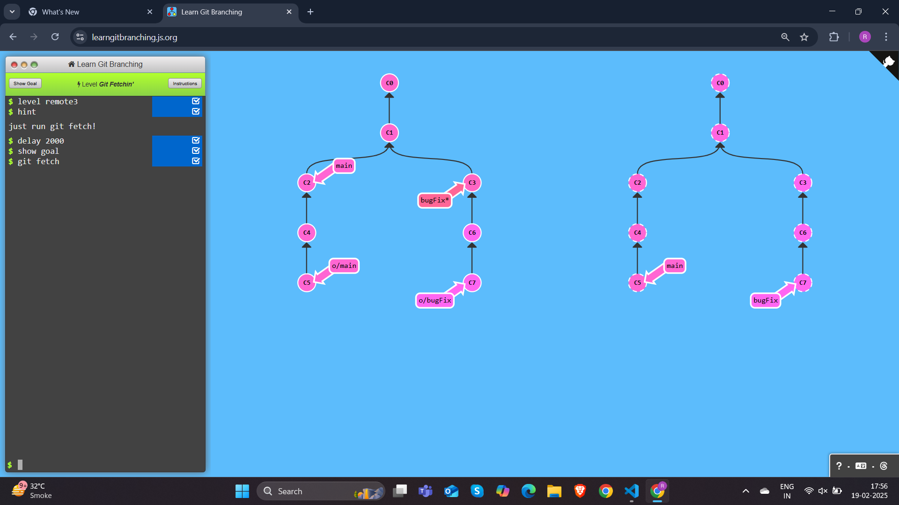

## Git Remotes 
## Push & Pull -- Git Remotes!
## Level 1 Our Command to create remotes


```
$ git clone
```
## Level 2 Git Remote Branches


```
$ git commit
$ git checkout o/main
$ git commit
```
## Level 3 Git Fetch



```
$ git fetch
```
## Level 4 Git Pull


```
$ git pull
```
## Level 5 Simulating collaboration


```
$ git commit
$ git clone
$ git branch -f main c1
$ git commit
$ git fetch
$ git merge o/main

```

## Level 6 Git Push


```
$ git commit
$ git commit
$ git push
```
## Level 7 Diverged Work


```
$ git clone
$ git fakeTeamwork main 1
$ git commit
$ git pull --rebase
$ git push
```

## Level 8 Remote Rejected!

```
$ git branch feature
$ git checkout feature
$ git push
$ git branch -f main c1

```
