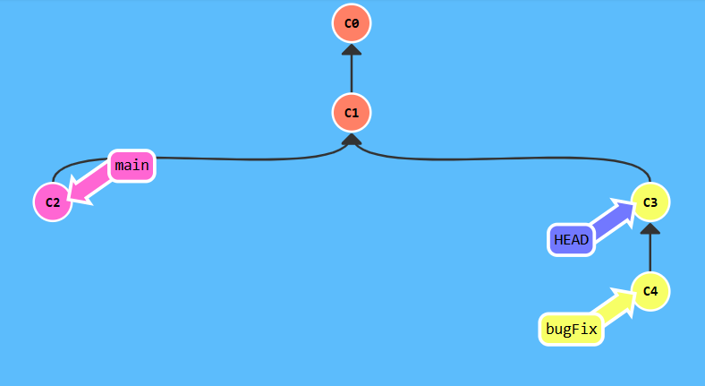

## Ramping Up

## Level 1 


```bash
$ git checkout c4
```

## Level 2


```bash
$ git checkout main
$ git checkout c3
```

## Level 3


```bash
$ git branch-f main c6  
$ git branch-f bugFix c0 
$ git checkout c1
```

## Level 4


```bash
$ git rebase -i HEAD~4 
```