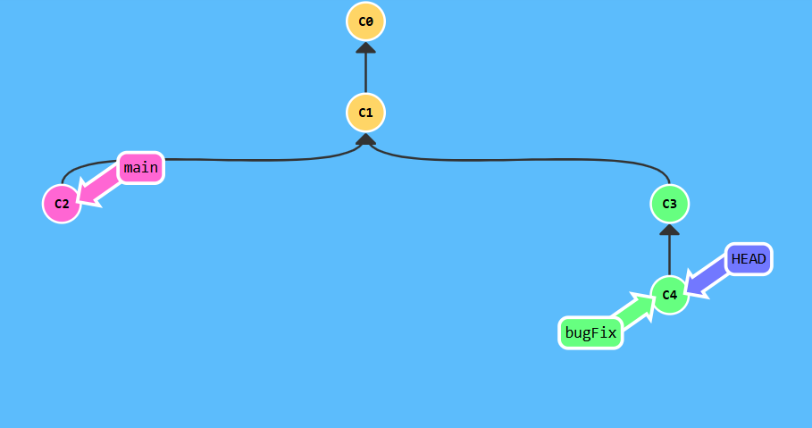
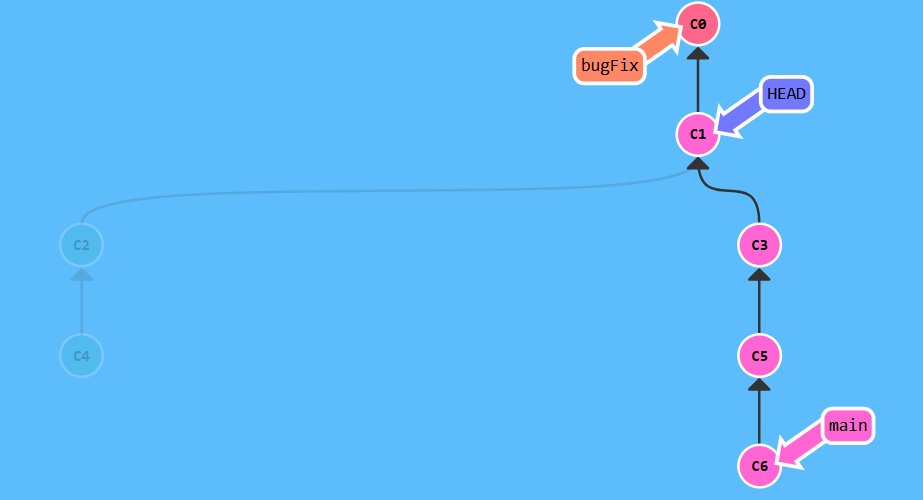
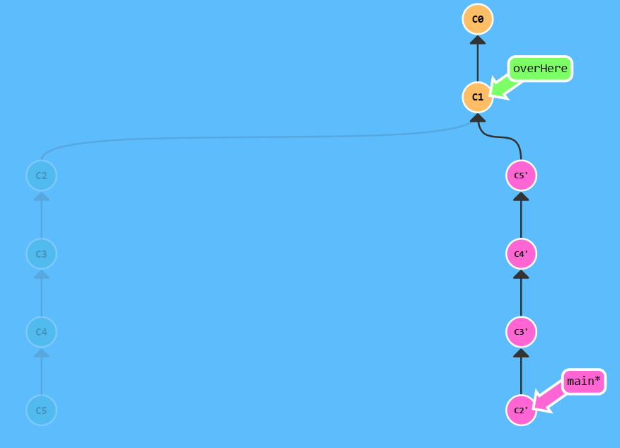

## Ramping Up

## Level 1 HEAD
 HEAD is the symbolic name for the currently checked out commit -- it's essentially what commit you're working on top of.
 HEAD always points to the most recent commit which is reflected in the working tree.



```bash
$ git checkout c4
```

## Level 2 Relative Refs
To make commits by their hash isn't the most convenient thing ever, which is why Git has relative refs.
Relative commits examples : 
Moving upwards one commit at a time with ^
Moving upwards a number of times with ~<num>


```bash
$ git checkout main
$ git checkout c3
```

## Level 3 The "~" operator
If needs to move a lot of levels up in the commit tree. It might be tedious to type ^ several times, so Git also has the tilde (~) operator.



```bash
$ git branch-f main c6  
$ git branch-f bugFix c0 
$ git checkout c1
```

## Level 4 Reversing Changes in Git
There are two primary ways to undo changes in Git -- one is using git reset and the other is using git revert.



```bash
$ git rebase -i HEAD~4 
```