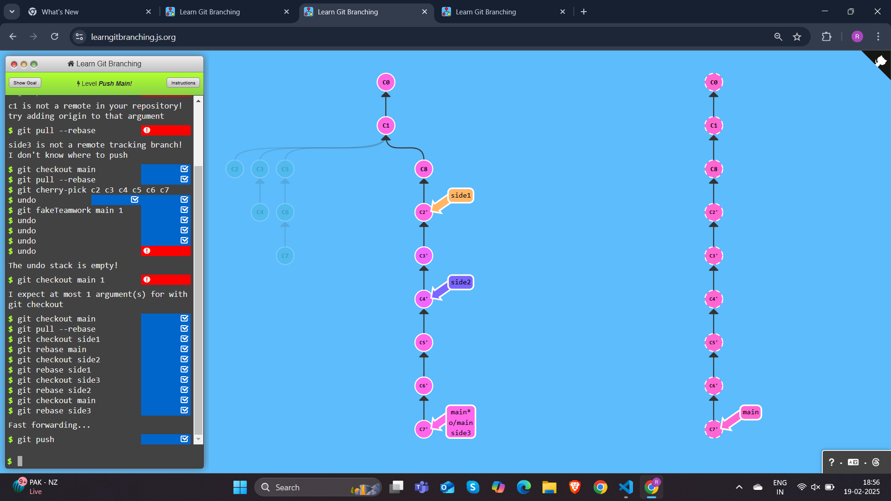
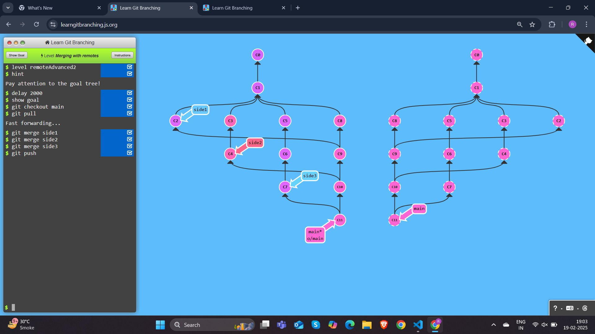

## To Origin And Beyond -- Advanced Git Remotes!
## Level 1 Merging feature branches

```
$ git checkout main
$ git pull --rebase
$ git checkout side1
$ git rebase main
$ git checkout side2
$ git rebase side1
$ git checkout side3
$ git rebase side2
$ git checkout main
$ git rebase side3
$ git push
```

## Level 2 Why not merge?

```
$ git checkout main
$ git pull
Fast forwarding...
$ git merge side1
$ git merge side2
$ git merge side3
$ git push
```
## Level 3 Remote-Tracking branches