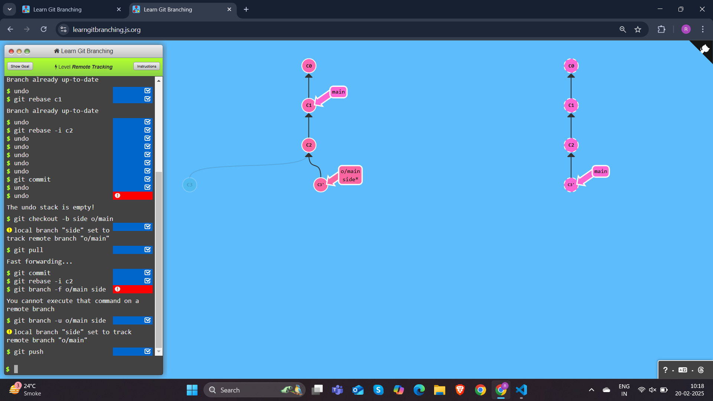
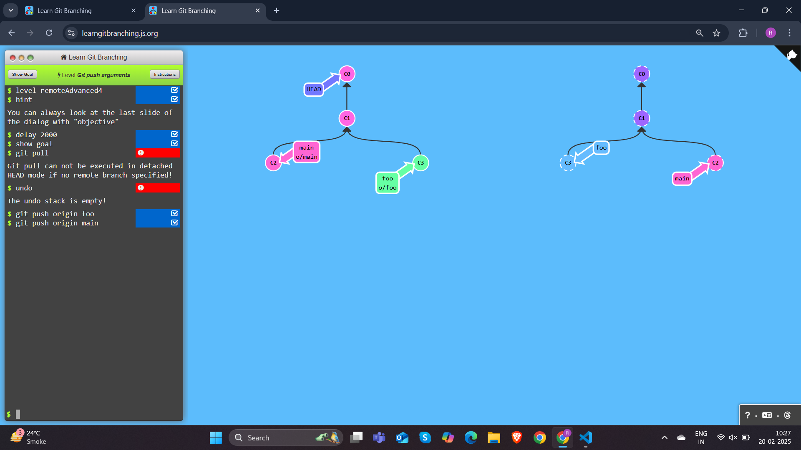
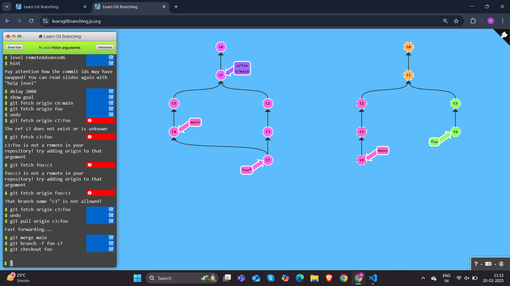
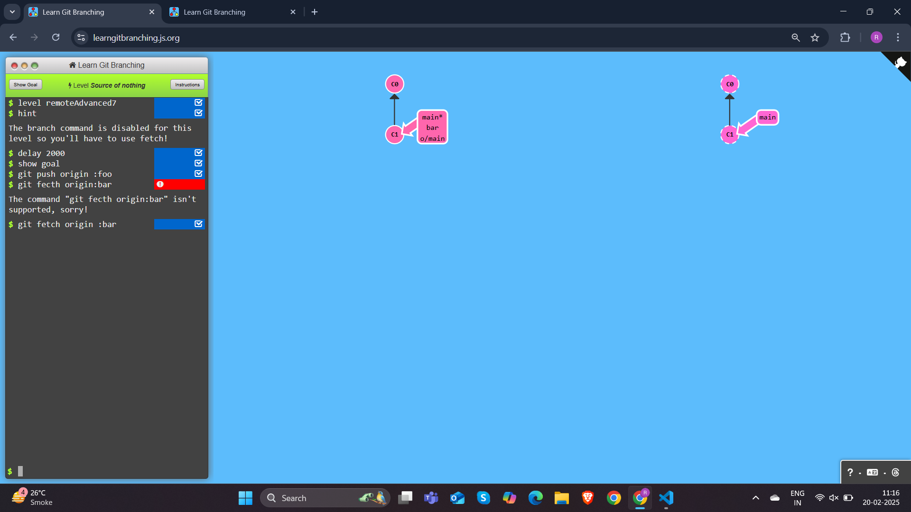
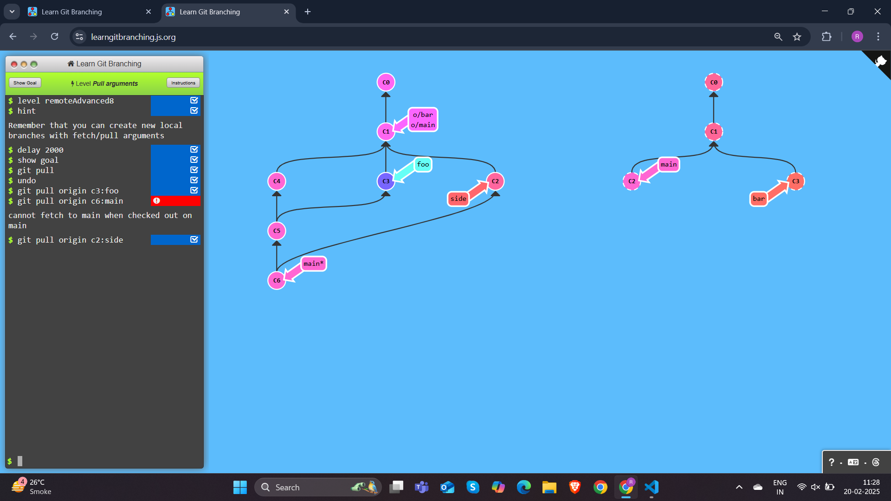

## To Origin And Beyond -- Advanced Git Remotes!
## Level 1 Merging feature branches

```
$ git checkout main
$ git pull --rebase
$ git checkout side1
$ git rebase main
$ git checkout side2
$ git rebase side1
$ git checkout side3
$ git rebase side2
$ git checkout main
$ git rebase side3
$ git push
```

## Level 2 Merge

```
$ git checkout main
$ git pull
Fast forwarding...
$ git merge side1
$ git merge side2
$ git merge side3
$ git push
```
## Level 3 Remote tracking branches



```
$ git checkout -b side o/main
$ git pull
$ git commit
$ git rebase -i c2
$ git push
```

## Level 4 Push Arguments

```
$ git push origin foo
$ git push origin main
```

## Level 5 <place> Argument details

```
$ git push origin main^:foo
$ git push origin foo:main
```
## Lvele 6 Git fetch Arguments


```
$ git fetch origin c6:mai
$ git pull origin c3:foo
$ git merge main
$ git branch -f foo c7
$ git checkout foo
```
## Level 7 Oddities of source

```
$ git push origin :foo
$ git fetch origin :bar
```

## Level 8 Git Pull Arguments

```
$ git pull origin c3:foo
$ git pull origin c2:side

```


